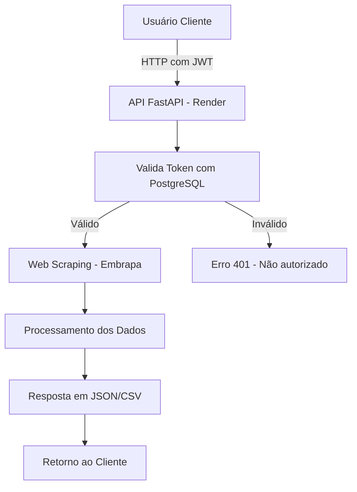
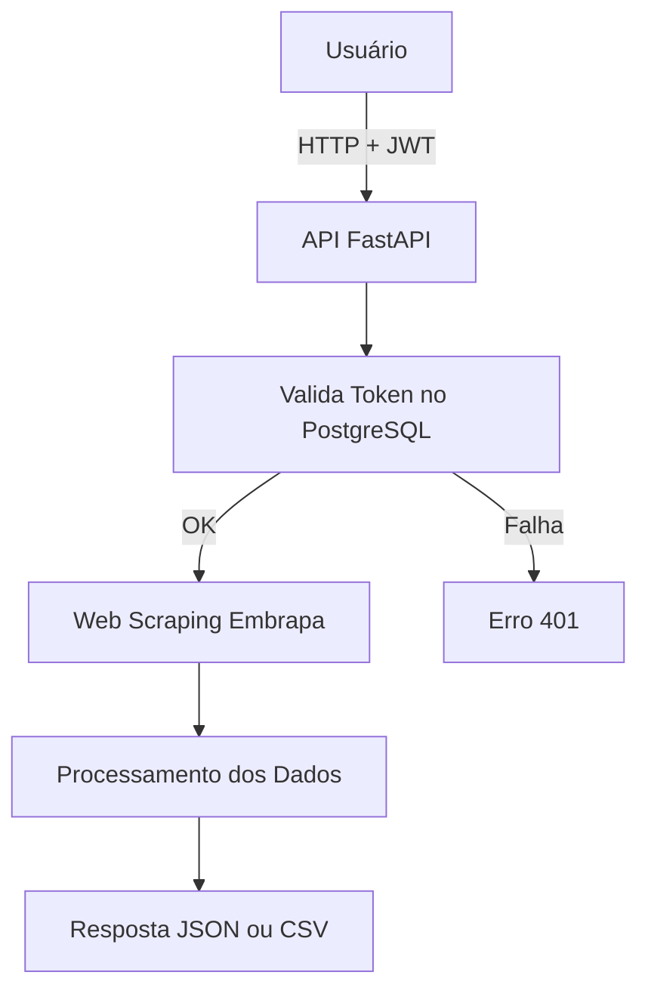

# API Vitivinicultura Embrapa - FIAP Tech Challenge

Esta API foi desenvolvida como parte do Tech Challenge da FIAP, com o objetivo de disponibilizar dados públicos sobre vitivinicultura do Brasil, fornecidos pela Embrapa. A API permite a consulta estruturada desses dados para futuras análises e utilização em modelos de Machine Learning.

## 🌐 Link para acesso à API

Acesse a documentação interativa (Swagger UI):  
[https://embrapa-fiap.onrender.com/docs](https://embrapa-fiap.onrender.com/docs)

---

## 📌 Objetivo

Criar uma API pública RESTful, desenvolvida em Python com FastAPI, que realiza Web Scraping em páginas da Embrapa e fornece os dados organizados para consumo por sistemas terceiros. A API utiliza autenticação JWT, está hospedada no Render e armazena informações de usuários e tokens em um banco de dados PostgreSQL.

---

## 🧩 Funcionalidades

A API disponibiliza dados das seguintes áreas:

- ✅ Produção  
- ✅ Processamento  
- ✅ Comercialização  
- ✅ Importação  
- ✅ Exportação  

Os dados podem ser retornados em formato JSON ou CSV, conforme preferência do cliente.

---

## 🔐 Autenticação

A API utiliza **JWT (JSON Web Token)** para autenticação. Cada requisição deve conter um token válido no cabeçalho `Authorization: Bearer <token>`.

### Validação:
- O token é verificado pelo FastAPI.
- A API consulta o banco PostgreSQL para validar o usuário e o token.
- Se inválido ou expirado, a requisição é negada com resposta de erro.
- Se válido, a requisição segue normalmente.

---

## 🛠️ Arquitetura da Solução




# 🍇 API Vitivinicultura Embrapa - Tech Challenge FIAP

Esta API foi desenvolvida como parte do **Tech Challenge da FIAP**. Seu objetivo é disponibilizar publicamente os dados de vitivinicultura do Brasil, a partir do site da **Embrapa**, permitindo análises e integração com futuros modelos de Machine Learning.

---

## 🚀 Link da API em Produção

Acesse a documentação interativa:  
👉 [https://embrapa-fiap.onrender.com/docs](https://embrapa-fiap.onrender.com/docs)

---

## 🧠 Descrição do Projeto

A API foi desenvolvida em **FastAPI** com autenticação JWT e deploy via **Render**, utilizando **Web Scraping** para coletar dados da [Embrapa Vitibrasil](http://vitibrasil.cnpuv.embrapa.br/). O banco de dados utilizado para armazenar os usuários é o **PostgreSQL**.

---

## 🧩 Arquitetura e Fluxo



---

## 🔐 Autenticação

A autenticação é feita via **JWT**.  
Inclua no cabeçalho da requisição:

```http
Authorization: Bearer <seu_token_aqui>
```

---

## 📚 Endpoints da API

### 🔑 Autenticação

#### `POST /auth/createToken`  
🔐 Gera tokens JWT de acesso e refresh.  
📥 Parâmetros (JSON): `username`, `password`  
📤 Retorno: `200 OK` com tokens ou `401 Unauthorized`

#### `POST /auth/refreshToken`  
🔁 Gera um novo token de acesso com o refresh token.  
📥 Parâmetros (JSON): `refresh_token`  
📤 Retorno: `200 OK` com novo token ou `401 Unauthorized`

---

### 👤 Usuários

#### `POST /auth/createUser`  
👤 Cria um novo usuário.  
📥 Parâmetros (JSON): `username`, `password`  
📤 Retorno: `201 Created`, `400 Bad Request`, `500 Internal Server Error`

#### `DELETE /auth/user/{user_id}`  
🗑️ Remove um usuário específico.  
📥 Parâmetros: `user_id` (na URL)  
📤 Retorno: `200 OK`, `401 Unauthorized`, `404 Not Found`

---

### 📊 Produção

#### `GET /producao/{year}`  
📅 Dados de produção de uvas por ano.  
📥 Parâmetro: `year` (ex: 2020)  
📤 Retorno: lista JSON de produtos e valores.

#### `GET /producao/{year_start}/{year_end}`  
📈 Produção em intervalo de anos.  
📥 Parâmetros: `year_start`, `year_end`  
📤 Retorno: lista JSON

---

### 🧃 Processamento

- `/processamento/viniferas/{year}`
- `/processamento/americanas/{year}`
- `/processamento/uvas/{year}`
- `/processamento/semClass/{year}`  
📊 Dados por tipo de uva e ano.

- `/processamento/viniferas/{start}/{end}`
- `/processamento/americanas/{start}/{end}`
- `/processamento/uvas/{start}/{end}`
- `/processamento/semClass/{start}/{end}`  
📈 Intervalo de anos para cada categoria.

---

### 💼 Comercialização

#### `GET /comercializacao/{year}`  
💰 Dados de comercialização por ano

#### `GET /comercializacao/{start}/{end}`  
💸 Comercialização por intervalo

---

### 🌍 Importação

- `/importacao/vinhosMesa/{year}`
- `/importacao/espumantes/{year}`
- `/importacao/uvasFrescas/{year}`
- `/importacao/uvasPassas/{year}`
- `/importacao/sucoUva/{year}`  
📦 Dados por ano

- `/importacao/vinhosMesa`
- `/importacao/espumantes`
- `/importacao/uvasFrescas`
- `/importacao/uvasPassas`
- `/importacao/sucoUva`  
📦 Dados por intervalo (query: `ano_inicio`, `ano_fim`)

---

### 🚢 Exportação

- `/exportacao/vinhosMesa/{year}`
- `/exportacao/espumantes/{year}`
- `/exportacao/uvasFrescas/{year}`
- `/exportacao/sucoUva/{year}`  
📤 Dados por ano

- `/exportacao/vinhosMesa`
- `/exportacao/espumantes`
- `/exportacao/uvasFrescas`
- `/exportacao/sucoUva`  
📤 Dados por intervalo (query: `ano_inicio`, `ano_fim`)

---

## 🧪 Testando a API

Você pode utilizar o Swagger UI, **Postman** ou **Insomnia** para testar a API.  
Não se esqueça de gerar e usar o token JWT antes de acessar os dados.

---

## 🧑‍💻 Desenvolvido por

- `Alexandre Cabanas - RM362932`
- `Gabriel Fernandes - RM362747`
- `Kauê Braz - RM362598`
- `Kaue Santana - RM363168`
- `Thomas Nícolas - RM362762`
  
- FIAP Tech Challenge 2025  
Projeto acadêmico, sem fins lucrativos.

---

## 📄 Licença

Este projeto é apenas para fins educacionais e segue a licença MIT.

